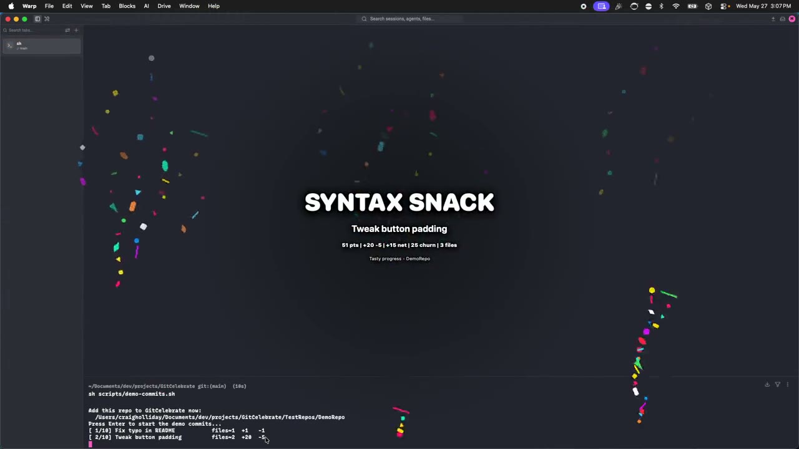

# GitCelebrate

A local-first macOS menu bar app that adds game-feel to your developer activity.
When you commit, push, merge, rebase, or switch branches, GitCelebrate plays a
brief, poppy celebration overlay — confetti, rockets, fireworks, and more —
scaled to the size of the change.

## Demo

[](assets/demo.mp4)

▶ **[Watch the demo video](assets/demo.mp4)** — celebrations firing across a
range of commit sizes.

## Features

- **Celebration overlays** — full-screen, transparent, click-through overlays
  with a soft spring pop-in and fade-out.
- **Reward scoring** — commit size (files changed, insertions, deletions) maps
  to an intensity tier, which picks the copy and animation variant.
- **Zero-setup repo observation** — watches `.git/logs/HEAD`, `.git/index`, and
  `.git/HEAD` with FSEvents; no hooks required.
- **Optional Git hooks** — a localhost server (`127.0.0.1:4545`) receives
  `post-commit` / `post-push` / `post-merge` payloads for precise events.

## Requirements

- macOS 26 or later
- Xcode 26 or later

## Build & run

```bash
open GitCelebrate.xcodeproj   # then build & run from Xcode (⌘R)
```

Or build straight from the command line:

```bash
xcodebuild build \
  -project GitCelebrate.xcodeproj \
  -scheme GitCelebrate \
  -destination 'platform=macOS'
```

## Tests

```bash
xcodebuild test \
  -project GitCelebrate.xcodeproj \
  -scheme GitCelebrate \
  -destination 'platform=macOS'
```

## Try it / demo

- In the app: **Settings → Appearance → Testing** has buttons to fire a test
  overlay, a burst of messages, and a tour of every animation variant.
- For a live demo against real commits, run
  [`scripts/demo-commits.sh`](scripts/demo-commits.sh): it builds a throwaway
  repo and makes 10 commits of escalating size so each triggers its own
  celebration. Add the generated repo under **Settings → Repositories** first.

## How it works

```text
Event source (repo observer / git hook)
  -> EventEngine
  -> RewardGenerator (score + copy + animation variant)
  -> OverlayManager (queue, debounce, merge)
  -> OverlaySceneView (SwiftUI + Canvas effects)
```

The overlay system is generic and source-agnostic — Git is just one event
source. See [`docs/ARCHITECTURE.md`](docs/ARCHITECTURE.md) for the full design.

## License

[MIT](LICENSE) © Craig Holliday
